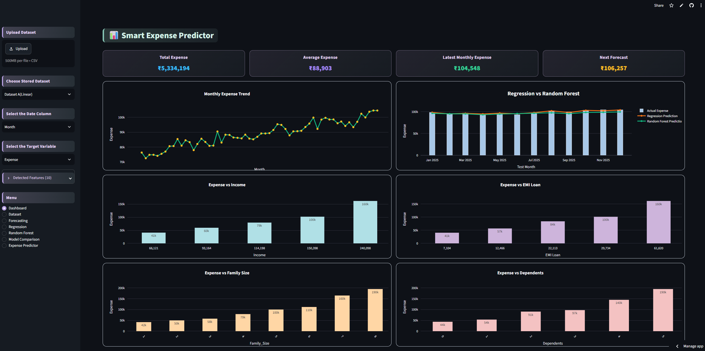
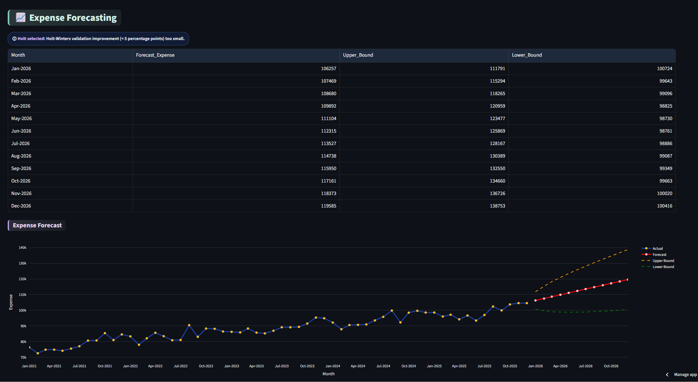
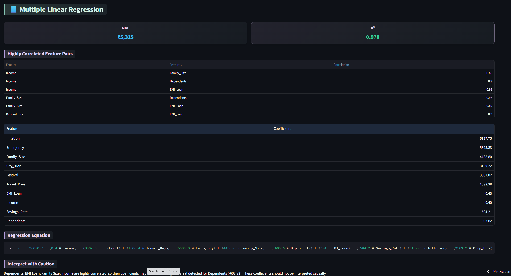
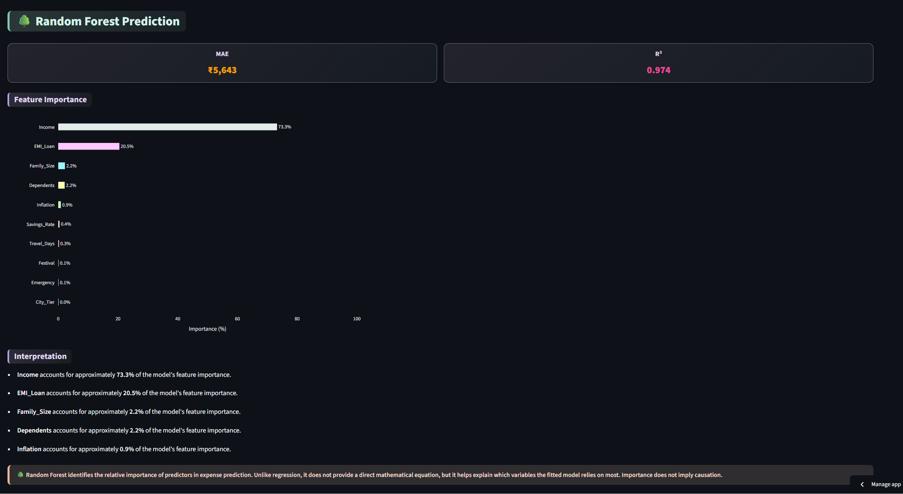
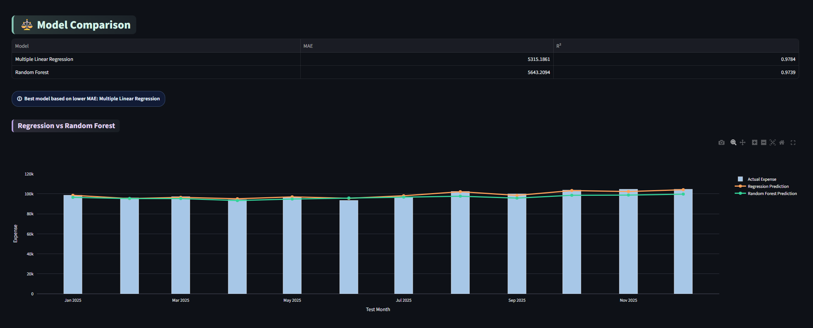
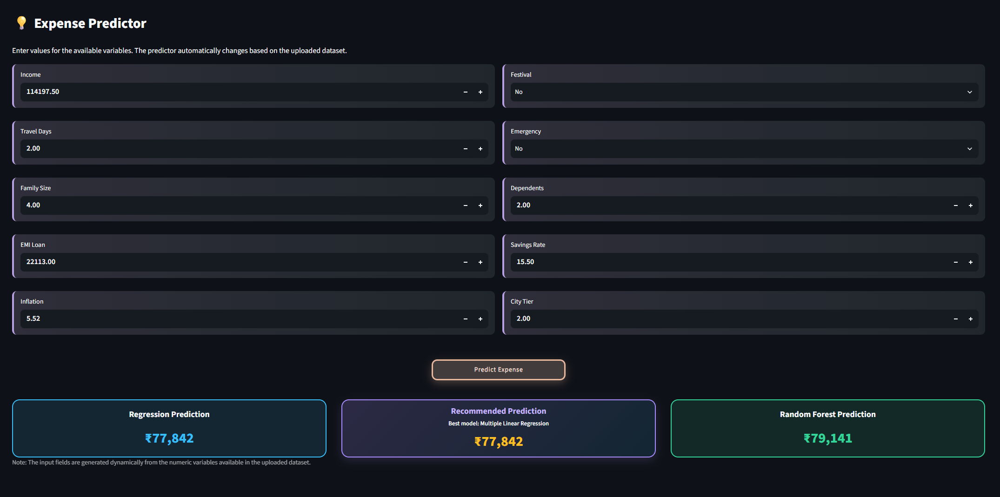

# Smart Household Expense Predictor

An interactive Streamlit web application that helps analyze, visualize, predict, and forecast household expenses using Machine Learning and Time Series Forecasting techniques.

---

## Project Overview

Managing household expenses effectively is essential for better financial planning. This application enables users to upload household expense datasets, explore spending patterns, compare machine learning models, and forecast future expenses through an interactive dashboard.

---

## Key Features

- Interactive Dashboard
- Exploratory Data Analysis (EDA)
- Expense Prediction using Machine Learning
- Time Series Forecasting
- Model Comparison
- Dynamic CSV Dataset Upload
- Downloadable Results

---
---

# Application Preview

## Dashboard

Interactive dashboard providing an overview of household expenses, KPIs, trends, and visual analytics.



---

## Forecasting

Forecast future household expenses using Holt's Linear Trend and Holt-Winters Exponential Smoothing models.



---

## Regression Analysis

Analyze the relationship between household expenses and financial variables using Multiple Linear Regression.



---

## Random Forest Analysis

Identify important factors influencing household expenses using Random Forest Regression.



---

## Model Comparison

Compare the performance of Linear Regression and Random Forest models using evaluation metrics.



---

## Expense Predictor

Predict household expenses based on user-provided inputs using the trained machine learning model.



## Technologies Used

- Python
- Streamlit
- Pandas
- NumPy
- Plotly
- Scikit-learn
- Power BI (Exploratory Data Analysis)
- Machine Learning

---

## Machine Learning Models

- Linear Regression
- Random Forest Regression

---

## Forecasting Models

- Holt's Linear Trend Method
- Holt-Winters Exponential Smoothing

---

## Project Structure

```
smart-household-expense-app/
│
├── app_new.py
├── README.md
├── requirements.txt
├── config.toml
│
├── datasets/
│   ├── Dataset A (Linear).csv      - Linear relationships
│   ├── Dataset B (Moderate).csv    - Moderately linear relationships
│   └── Dataset C (Complex).csv     - Complex/non-linear relationships
│
├── screenshots/
│   ├── Dashboard.png
│   ├── Forecasting.png
│   ├── Regression.png
│   ├── Random Forest.png
│   ├── Model Comparison.png
│   └── Expense Predictor.png
│
└── .streamlit/
```

---

## Run Locally

```bash
pip install -r requirements.txt
streamlit run app_new.py
```

---

## Project Highlights

- Interactive financial dashboards
- Household expense prediction
- Time series forecasting
- Model performance comparison
- User-friendly Streamlit interface

---

## Future Improvements

- Multiple dataset support
- Additional forecasting models
- Cloud database integration
- Export to PDF reports
- User authentication

---

## Author

**Aswini Star Alphonse**

Aspiring Data Analyst

Python • Machine Learning • Data Analytics
